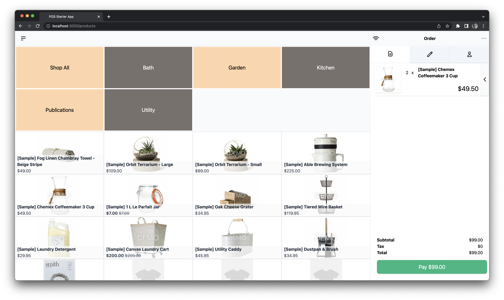
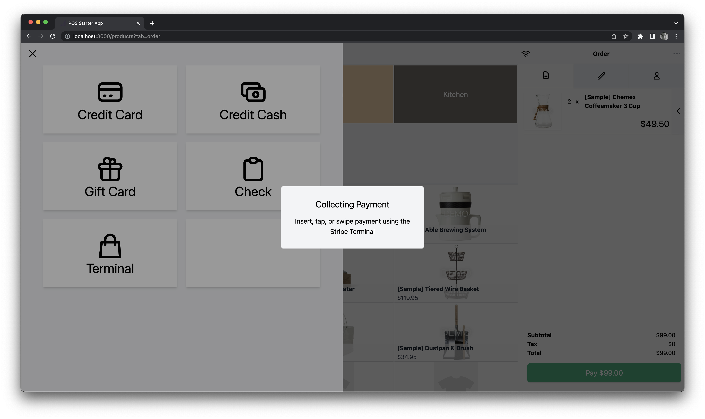

# BigCommerce Point of Sale Foundation

This open source proof-of-concept app showcases the BigCommerce platform's customizable ability to support point-of-sale transactions.

💰 **Integrated with Stripe Terminal**. Secure, pre-certified hardware with an SDK that recognizes multiple registers at a single location.

🚀 **Powered by MongoDB Cloud and the Prisma ORM**. Pre-configured migrations and seed data help you get started customizing the look, feel, and functionality of your POS implementation.


| Register View | Checkout View |
|:-------------:|:-------------:|
|  |  |

## Core technologies

* Node.js 14.x / npm
* A [BigCommerce (sandbox) store](https://developer.bigcommerce.com/api-docs/partner/getting-started/create-a-sandbox-store?source=pos-foundation)
* A [pre-certified Stripe Terminal EMV card reader](https://stripe.com/terminal)


## Getting started

Find prerequisites, configuration details, and more in the [POS Foundation Guide](https://developer.bigcommerce.com/api-docs/partner/pos-solutions/foundation-guide?source=pos-foundation) at the [BigCommerce Dev Center](https://developer.bigcommerce.com).


## Directory structure highlights

```shell
...
├── backend/
    # Authentication and shared API services
├── prisma/ 
    # DB models, migrations, and seed data
├── public/
├── shared/
    # Shared types
└── src/
    ...
    ├── pages/
        # Top-level React component views and API routes
        # See https://nextjs.org/docs/basic-features/pages
        └── api/
        # The page's API routes
        # See https://nextjs.org/docs/api-routes/introduction
    └── providers/
        # Context providers for pages.
        # Most providers use a single higher-order 'ActionBuilder' wrapper to execute functions, set data, and update loading status. This pattern minimizes side effects and ensures consistent error handling.  
        └── {NameOfProvider}/
            ├── index.ts        
                # The actions available to this provider's page and its child components.
            ├── context.ts 
                # The types available to this provider's page and its child components.
            └── methods.ts
                # The functions called by the provider's actions to fetch / modify data.

```

## Contributing

Want to help expand this foundation? We'd love to collaborate! You can start with this list of both potential improvements and features worth adding to the existing codebase. You can also check out the [expansion resources](https://developer.bigcommerce.com/api-docs/partner/pos-solutions/foundation-guide?source=pos-foundation#expansion-resources) in our Dev Center's POS Foundation Guide.

### Improvements

| Location / Feature | Description |
|:-------------------|:------------|
| `backend/services/employee.service.ts` | Improve error handling and types within try/catch block. |
| `src/providers/CartProvider/context.ts` | Create types for `CreatePaymentIntentResponse` and `CapturePaymentIntentResponse`. |
| `src/components/modules/Orders/TenderDialog.tsx` | Move the transaction success view into the listed component. |
| `src/components/modules/Orders/TenderCash.tsx` | Move the numeric entry pad into the listed component. |
| Error handling | Supply a generic method to show error messages on the frontend; incorporate more graceful error handling for API calls. |
| Loading indicators | Add a shared component to handle loading indicators, both overall and within buttons. |
| `src/providers/CartProvider` | Create types for customer lookup actions. |
| Types | Pending the release of the new BigCommerce Nodejs API client, refactor to replace the app's type system with the new standard types. |
| Validity checks on load | If the BigCommerce store setup or environment variables are invalid, prevent the app from loading and provide instructions on how to remedy the failure. |
### Features 

| Feature Description | Goal |
|:--------------------|:-----|
| Refactor as a BigCommerce app with a dedicated sales channel | <ul><li>Access the POS from the **Channel Manager** view in the store control panel</li><li>Use in multiple physical locations</li><li>Associate transactions with the POS storefront</li></ul> |
| A ship-to-customer checkout flow | Create and select shipping addresses |
| Customer management view and logic | CRUD customer-related data |
| Retrieve incomplete checkouts | Finalize or discard transactions |
| Support additional hardware | <ul><li>Print receipts</li><li>Scan barcodes</li><li>Operate cash drawers</li></ul> |
| Product lookup view and logic | Search for products |
| Support multi-location inventory-related (MLI) features | <ul><li>Buy online, pickup in store (BOPIS)</li><li>Buy online, return in store (BORIS)</li><li>Buy in store, pickup at another store</li><li>Buy in store for delivery</li></ul> |
| Select a transaction's currency from the list of transactional currencies active on the POS channel | Accept multiple currencies |
| Integrate Orders V3 functionality | Accept returns, give refunds, etc. |
| Issue, manage, and accept customer-centered payment methods | <ul><li>Gift cards</li><li>Store credit</li><li>Loyalty cards</li></ul> |
| Multi-cashier functionality | Shift change operations, audit support, etc. |

## Learn more

### Existing point of sale solutions

Check out the variety of POS apps on the [BigCommerce App Marketplace](https://www.bigcommerce.com/apps/in-store/?source=pos-foundation).

### The BigCommerce platform

Looking to help the world's leading brands and the next generation of successful merchants take flight? To learn more about developing with the BigCommerce platform, take a look at the following resources:

- [BigCommerce Dev Center](https://developer.bigcommerce.com/?source=pos-foundation) - Learn more about BigCommerce platform features, APIs and SDKs
- [BigDesign](https://developer.bigcommerce.com/big-design/?source=pos-foundation) - BigCommerce's library of React components with sandbox tools
- [Building BigCommerce Apps](https://developer.bigcommerce.com/api-docs/apps/guide/intro?source=pos-foundation) - Learn more about apps, from lightweight single-merchant customizations to fully-featured apps you can sell in the BigCommerce App Marketplace

### Expansion resources
* [Multi-Storefront Overview](https://support.bigcommerce.com/s/article/Multi-Storefront)
* [Subscription Foundation README](https://github.com/bigcommerce/subscription-foundation/blob/main/README.md)
* [Subscription Foundation Overview](https://developer.bigcommerce.com/api-docs/partner/subscription-solutions/foundation-guide)
* [Channels API Reference](https://developer.bigcommerce.com/api-reference/store-management/channels/channels/createchannel)
* [App API Accounts](/api-docs/getting-started/authentication/rest-api-authentication#app-api-accounts)
* [Guide to Building Apps](https://developer.bigcommerce.com/api-docs/apps/guide/intro)
